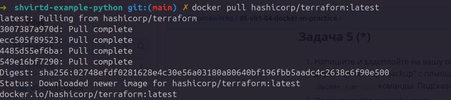

## Домашнее задание Домашнее задание по занятию "Практическое применение Docker"
### Задание 1

https://github.com/olyavoznuyk/shvirtd-example-python

### Задание 2


### Задание 4

* screenshot 


* bash script 

```
REPO_URL="https://github.com/olyavoznuyk/shvirtd-example-python.git"
TARGET_DIR="/opt/shvirtd-example-python"

git clone "$REPO_URL" "$TARGET_DIR"

cd "$TARGET_DIR" || exit

docker compose up -d
```

* git link

https://github.com/olyavoznuyk/shvirtd-example-python

### Задание 6




### Задание 6.1

